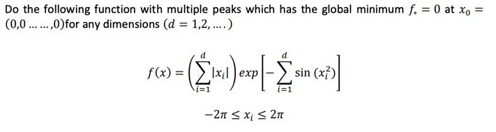

# META SEZGİSEL OPTİMİZASYON TEKNİKLERİ

## PSO Module Homework

### Rana Pay y215012068

-----------------------

### **Problem**



### **Farklı seed değerlerine göre programın sonuçları, ekran resimleri ve Convergence grafikleri**

| Seed | resultX, resultY     | Minimum Cost | Ekran Resimleri         | Convergence grafikleri                 |
|------|----------------------|--------------|-------------------------|----------------------------------------|
| 10   | **-0.1228,  0.7287** | **-1.0258**  |  |  |
| 20   | **-0.4265, 0.8265**  | **-0.5550**  |  |  | 
| 30   | **0.0720, 0.6093**   | **-0.8691**  |  |  | 
| 40   | **-0.2743, 0.7877**  | **-0.8681**  |  |  |
| 50   | **0.1615,  0.5149**  | **-0.5931**  |  |  |

### **Program Komutları**

``` 
package main

import (
	"fmt"
	"gonum.org/v1/plot"
	"gonum.org/v1/plot/plotter"
	"gonum.org/v1/plot/vg"
	"math"
	"math/rand"
)

type Problem struct{}

func (p Problem) cost(x float64, y float64) float64 {
	return (4-2*math.Pow(x, 2)+math.Pow(x, 4)/3)*math.Pow(x, 2) + (x * y) + (-4+4*math.Pow(y, 2))*math.Pow(y, 2)
}

func moveOperator(xi, yi float64) (float64, float64) {
	// Hareket operatörü: Mevcut çözümden rastgele bir değer ekleyerek yeni bir çözüm elde etmek
	gama := rand.Float64()
	if gama > 0 && 0.5 >= gama {
		return xi + gama, yi + gama
	} else if 0.5 < gama && gama <= 0.7 {
		return xi - gama, yi - gama
	} else {
		return xi, yi
	}
}

func acceptanceProbability(costDifference, temperature float64) float64 {
	return math.Exp(-costDifference / temperature)
}

func simulatedAnnealing(problem Problem, xo, yo, To, Tf, α float64, m, n int) (float64, float64, []float64) {
	var costs []float64
	xi := xo
	yi := yo
	xF := xo
	yF := yo
	Tt := To

	for t := 1; t <= m; t++ {
		for i := 1; i <= n; i++ {
			xTEMP, yTEMP := moveOperator(xi, yi)
			currentCost := problem.cost(xi, yi)
			newCost := problem.cost(xTEMP, yTEMP)
			costDifference := newCost - currentCost

			acceptanceProb := acceptanceProbability(costDifference, Tt)

			if newCost <= currentCost || rand.Float64() <= acceptanceProb {
				xi = xTEMP
				yi = yTEMP
			}

			if problem.cost(xi, yi) <= problem.cost(xF, yF) {
				xF = xi
				yF = yi
			}
			costs = append(costs, problem.cost(xF, yF)) // Her adımda maliyet değerini kaydet
		}
		Tt = α * Tt
		if Tt < Tf {
			break
		}
	}

	return xF, yF, costs
}

func main() {

	rand.Seed(10)
	fmt.Printf("RandomSeed değeri: %d\n", 10)

	problem := Problem{}
	xo := rand.Float64() - 3 // Başlangıç çözümü
	yo := rand.Float64() - 2 // Başlangıç çözümü
	To := 10000.0            // Başlangıç sıcaklığı
	Tf := 0.0001             // Sınır sıcaklığı
	α := 0.98                // Soğuma parametresi
	m := 1000                // Aşama sayısı
	n := 500                 // Her aşamadaki adım sayısı

	resultX, resultY, costs := simulatedAnnealing(problem, xo, yo, To, Tf, α, m, n)
	minimum := problem.cost(resultX, resultY)

	fmt.Printf("En küçük değeri bulan x: %.4f\n", resultX)
	fmt.Printf("En küçük değeri bulan y: %.4f\n", resultY)
	fmt.Printf("En küçük değer: %.4f\n", minimum)

	// Konverjans grafiğini çizme
	p := plot.New()

	points := make(plotter.XYs, 5000)
	for i := range points {
		points[i].X = float64(i)
		points[i].Y = costs[i]
	}

	line, err := plotter.NewLine(points)
	if err != nil {
		panic(err)
	}
	p.Add(line)

	p.Title.Text = "Konverjans Grafiği"
	p.X.Label.Text = "Adım Sayısı"
	p.Y.Label.Text = "Maliyet"

	if err := p.Save(6*vg.Inch, 4*vg.Inch, "konverjans_grafigi.png"); err != nil {
		panic(err)
	}
	fmt.Println("\nKonverjans grafiği oluşturuldu: konverjans_grafigi.png")
}
```
