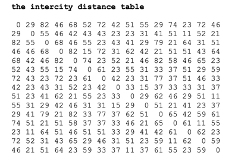
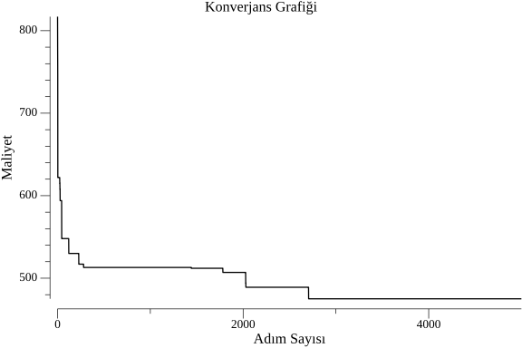

# META SEZGİSEL OPTİMİZASYON TEKNİKLERİ

## Simulated Annealing Traveling Salesperson Problem

### Rana Pay y215012068

-----------------------

### **Problem**


### **Program Çıktısı ve Convergence Grafiği**

| Program Çıktısı                                                                 | Convergence Grafiği                 |
|---------------------------------------------------------------------------------|-------------------------------------|
|  <br/> **Bulunan Rota : 12 0 10 3 5 7 9 13 11 2 6 4 8 14 1** |  |

**Minimum Cost = 291**

### **Program Komutları**

```
package main

import (
	"fmt"
	"gonum.org/v1/plot"
	"gonum.org/v1/plot/plotter"
	"gonum.org/v1/plot/vg"
	"math"
	"math/rand"
	"time"
)

// TSP problemini temsil eden yapı
type TSPProblem struct {
	distances [][]float64 // Mesafe matrisi
}

// Yeni bir TSP problemi oluşturur
func NewTSPProblem(distances [][]float64) *TSPProblem {
	return &TSPProblem{
		distances: distances,
	}
}

// Simulated Annealing algoritması ile TSP çözümü
func (t *TSPProblem) SolveTSP(initialRoute []int, initialTemperature, finalTemperature, alpha float64, m, n int) ([]int, []float64) {
	rand.Seed(time.Now().UnixNano())

	var costs []float64

	currentRoute := make([]int, len(initialRoute))
	copy(currentRoute, initialRoute)
	bestRoute := make([]int, len(initialRoute))
	copy(bestRoute, currentRoute)

	temperature := initialTemperature

	currentCost := t.calculateTotalDistance(currentRoute)
	bestCost := currentCost

	for j := 1; j <= m; j++ {
		for i := 1; i <= n; i++ {
			newRoute := t.modifyRoute(currentRoute)
			newCost := t.calculateTotalDistance(newRoute)
			costDifference := newCost - currentCost

			acceptanceProb := acceptanceProbability(costDifference, temperature)

			if costDifference <= 0 || rand.Float64() <= acceptanceProb {
				currentRoute = make([]int, len(newRoute))
				copy(currentRoute, newRoute)
				currentCost = newCost
			}

			if currentCost <= bestCost {
				bestRoute = make([]int, len(currentRoute))
				copy(bestRoute, currentRoute)
				bestCost = currentCost
			}
			costs = append(costs, bestCost) // Her adımda maliyet değerini kaydet
		}
		temperature = alpha * temperature
		if temperature < finalTemperature {
			break
		}
	}

	return bestRoute, costs
}

// Yolu değiştirir
func (t *TSPProblem) modifyRoute(route []int) []int {
	newRoute := make([]int, len(route))
	copy(newRoute, route)

	i, j := rand.Intn(len(newRoute)), rand.Intn(len(newRoute))
	newRoute[i], newRoute[j] = newRoute[j], newRoute[i]

	return newRoute
}

// Toplam mesafeyi hesaplar
func (t *TSPProblem) calculateTotalDistance(route []int) float64 {
	totalDistance := 0.0
	for i := 0; i < len(route)-1; i++ {
		totalDistance += t.distances[route[i]][route[i+1]]
	}
	totalDistance += t.distances[route[len(route)-1]][route[0]] // Son şehirden başlangıç şehrine olan mesafe

	return totalDistance
}

func acceptanceProbability(costDifference, temperature float64) float64 {
	return math.Exp(-costDifference / temperature)
}

func main() {
	// Örnek mesafe matrisi
	distances := [][]float64{
		{0, 29, 82, 46, 68, 52, 72, 42, 51, 55, 29, 74, 23, 72, 46},
		{29, 0, 55, 46, 42, 43, 43, 23, 23, 31, 41, 51, 11, 52, 21},
		{82, 55, 0, 68, 46, 55, 23, 43, 41, 29, 79, 21, 64, 31, 51},
		{46, 46, 68, 0, 82, 15, 72, 31, 62, 42, 21, 51, 51, 43, 64},
		{68, 42, 46, 82, 0, 74, 23, 52, 21, 46, 82, 58, 46, 65, 23},
		{52, 43, 55, 15, 74, 0, 61, 23, 55, 31, 33, 37, 51, 29, 59},
		{72, 43, 23, 72, 23, 61, 0, 42, 23, 31, 77, 37, 51, 46, 33},
		{42, 23, 43, 31, 52, 23, 42, 0, 33, 15, 37, 33, 33, 31, 37},
		{51, 23, 41, 62, 21, 55, 23, 33, 0, 29, 62, 46, 29, 51, 11},
		{55, 31, 29, 42, 46, 31, 31, 15, 29, 0, 51, 21, 41, 23, 37},
		{29, 41, 79, 21, 82, 33, 77, 37, 62, 51, 0, 65, 42, 59, 61},
		{74, 51, 21, 51, 58, 37, 37, 33, 46, 21, 65, 0, 61, 11, 55},
		{23, 11, 64, 51, 46, 51, 51, 33, 29, 41, 42, 61, 0, 62, 23},
		{72, 52, 31, 43, 65, 29, 46, 31, 51, 23, 59, 11, 62, 0, 59},
		{46, 21, 51, 64, 23, 59, 33, 37, 11, 37, 61, 55, 23, 59, 0},
	}

	tsp := NewTSPProblem(distances)

	// Başlangıç rotası
	initialRoute := []int{0, 1, 2, 3, 4, 5, 6, 7, 8, 9, 10, 11, 12, 13, 14}

	// Simulated Annealing ile TSP çözümü
	finalRoute, costs := tsp.SolveTSP(initialRoute, 10000, 0.0001, 0.98, 1000, 500)

	// Sonuç rotası ve toplam mesafe
	fmt.Println("Başlangıç Rota:", initialRoute)
	fmt.Println("Sonuç Rota:", finalRoute)
	fmt.Println("Toplam Mesafe:", tsp.calculateTotalDistance(finalRoute))

	// Konverjans grafiğini çizme
	p := plot.New()

	points := make(plotter.XYs, 5000)
	for i := range points {
		points[i].X = float64(i)
		points[i].Y = costs[i]
	}

	line, err := plotter.NewLine(points)
	if err != nil {
		panic(err)
	}
	p.Add(line)

	p.Title.Text = "Konverjans Grafiği"
	p.X.Label.Text = "Adım Sayısı"
	p.Y.Label.Text = "Maliyet"

	if err := p.Save(6*vg.Inch, 4*vg.Inch, "konverjans_grafigi_%d.png"); err != nil {
		panic(err)
	}
	fmt.Println("\nKonverjans grafiği oluşturuldu: konverjans_grafigi.png")
}

```